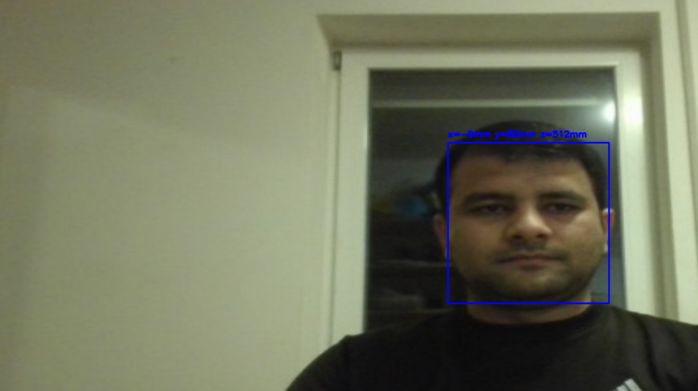
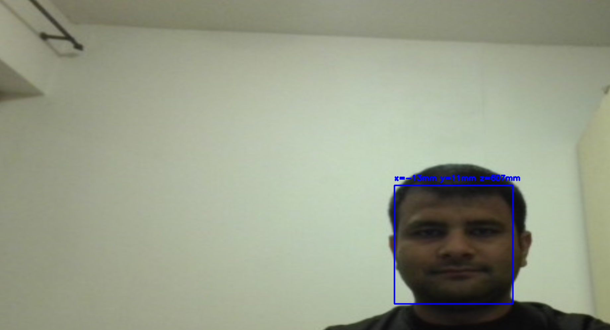

# 3D Face Tracking System

A real-time 3D face position tracking system using computer vision and camera calibration. This project detects faces in a video stream and calculates their 3D position (x, y, z coordinates) relative to the camera in millimeters.



## 🌟 Features

- **Real-time Face Detection**: Uses OpenCV's Haar Cascade classifier for robust face detection
- **3D Position Estimation**: Calculates x, y, z coordinates in millimeters using camera calibration
- **Camera Calibration Integration**: Corrects lens distortion using pre-calibrated camera parameters
- **Live Data Visualization**: Real-time plotting of face position over time
- **High Resolution Support**: Operates at 1920x1080 resolution for accurate tracking

## 📊 Results

### Face Detection with 3D Position

The system successfully detects faces and displays their 3D position in real-time:

**Centered Position:**


*The system accurately tracks the face position with coordinates displayed in real-time: x=9mm, y=88mm, z=512mm*

**Off-center Position:**



*As the face moves, the system updates the 3D coordinates: x=-60mm, y=-11mm, z=608mm*

### Position Tracking Over Time

The graph below shows the tracked position data over multiple frames:


**Graph Analysis:**
- **Green line (z)**: Distance from camera (depth) - ranges from ~200mm to ~800mm
  - Shows user moving closer and farther from the camera
  - Stabilizes around 350mm after frame 100
- **Blue line (y)**: Vertical position - small variations around center
  - Shows slight up/down head movements
  - Mostly stable with occasional dips
- **Orange line (x)**: Horizontal position - minimal movement when centered
  - Indicates left/right position relative to camera center
  - Stays close to zero, showing good centering

The tracking demonstrates stable position estimation with the system accurately following face movement in 3D space.

## 🛠️ Technology Stack

- **Python 3.x**
- **OpenCV**: Face detection and camera calibration
- **DearPyGUI**: Real-time GUI and data visualization
- **NumPy**: Numerical computations
- **Pickle**: Calibration data serialization

## 📋 Prerequisites
```bash
pip install opencv-python
pip install dearpygui
pip install numpy
```

## 🚀 Installation

1. **Clone the repository:**
```bash
git clone https://github.com/syedrafayme143/Face-3D-position-estimation.git
cd 3d-face-tracking
```

2. **Install dependencies:**
```bash
pip install -r requirements.txt
```

3. **Prepare camera calibration file:**
   - Ensure you have a `calibration_data.pkl` file containing your camera's calibration parameters
   - This file should contain:
     - `camera_matrix`: 3x3 intrinsic camera matrix
     - `distortion_coefficients`: Lens distortion coefficients

## 📁 Project Structure
```
3d-face-tracking/
│
├── face.py                      # Main application file
├── DataPlot.py                  # Data visualization module
├── calibration_data.pkl         # Camera calibration data
├── requirements.txt             # Python dependencies
├── README.md                    # Project documentation
├── LICENSE                      # MIT License
├── CONTRIBUTING.md              # Contribution guidelines
│
└── Results/                     # Result images
    ├── result-face-detection-3d-position.png
    ├── result-face-detection-3d-position-variant.png
    └── result-face-position-graph_png.PNG
```

## 💻 Usage

Run the main application:
```bash
python face.py
```

### Controls

- **Video Window**: Displays real-time face detection with position overlay
- **GUI Window**: Shows live graph of x, y, z positions over time
- Press **'q'** in the video window to quit the application

### Understanding the Output

The system displays three coordinates in millimeters:

- **x**: Horizontal position (left/right from camera center)
  - Negative values: Face is to the left
  - Positive values: Face is to the right
  
- **y**: Vertical position (up/down from camera center)
  - Negative values: Face is below center
  - Positive values: Face is above center
  
- **z**: Depth/Distance from camera
  - Measured from the camera lens
  - Typically ranges from 300mm to 1000mm

## 🔬 How It Works

### 1. Camera Calibration
The system uses pre-calibrated camera parameters to correct lens distortion and enable accurate 3D measurements.

### 2. Face Detection
OpenCV's Haar Cascade classifier detects faces in each frame, providing a bounding box around detected faces.

### 3. 3D Position Calculation

The system calculates 3D position using:

- **Known face width**: Assumes average human face width of 140mm
- **Camera intrinsics**: Focal length and principal point from calibration
- **Angular geometry**: Calculates viewing angles to face edges
- **Triangulation**: Derives distance (z) from angular subtense
- **Projection**: Computes x and y from center point projection

**Mathematical approach:**
```
z = FACE_WIDTH / (2 * tan(angular_width / 2))
x = (z / focal_length) * horizontal_pixel_offset
y = -(z / focal_length) * vertical_pixel_offset
```

### 4. Real-time Visualization
Position data is plotted in real-time using DearPyGUI, showing temporal changes in face position.

## ⚙️ Configuration

Key parameters in `face.py`:
```python
FACE_WIDTH_MM = 140        # Average face width (adjustable)
TARGET_WIDTH = 1920        # Video resolution width
TARGET_HEIGHT = 1080       # Video resolution height
CALIBRATION_FILE = 'calibration_data.pkl'  # Calibration data path
```

## 🎯 Applications

- **Human-Computer Interaction**: Gaze tracking and gesture control
- **Accessibility**: Head-based mouse control
- **Virtual Reality**: Head tracking for VR/AR applications
- **Attention Monitoring**: Focus and engagement tracking
- **Photography**: Auto-focus and framing assistance
- **Gaming**: Motion-based game controls

## 🔧 Troubleshooting

### Common Issues

**1. Camera not detected:**
```python
# Ensure your camera is properly connected
# Try different camera indices (0, 1, 2, etc.)
self.video_capture = cv2.VideoCapture(0)
```

**2. Calibration file not found:**
```
FileNotFoundError: Calibration file 'calibration_data.pkl' not found
```
**Solution**: Perform camera calibration first or ensure the file is in the correct directory.

**3. No face detected:**
- Ensure adequate lighting
- Face the camera directly
- Adjust `minNeighbors` and `minSize` parameters in face detection

**4. Inaccurate measurements:**
- Verify camera calibration quality
- Adjust `FACE_WIDTH_MM` for better accuracy
- Ensure camera is stable and not moving

## 📈 Performance

- **Detection Rate**: ~30 FPS on modern hardware
- **Accuracy**: ±10mm at distances of 300-800mm
- **Latency**: <50ms for position calculation
- **Resolution**: 1920x1080 for optimal accuracy

## 🤝 Contributing

Contributions are welcome! Please feel free to submit issues and pull requests.

1. Fork the repository
2. Create your feature branch (`git checkout -b feature/AmazingFeature`)
3. Commit your changes (`git commit -m 'Add some AmazingFeature'`)
4. Push to the branch (`git push origin feature/AmazingFeature`)
5. Open a Pull Request

See [CONTRIBUTING.md](CONTRIBUTING.md) for detailed guidelines.

## 📝 Future Enhancements

- [ ] Multi-face tracking support
- [ ] Kalman filtering for smoother position estimates
- [ ] CSV data export functionality
- [ ] Configurable face width per user
- [ ] 3D visualization of face position
- [ ] Support for depth cameras (RealSense, Kinect)
- [ ] Machine learning-based face detection (YOLO, SSD)

## 📄 License

This project is licensed under the MIT License - see the [LICENSE](LICENSE) file for details.

## 👨‍💻 Author

Syed Rafay Ali - [syedrafayme143@gmail.com](mailto:syedrafayme143@gmail.com)

Project Link: [https://github.com/syedrafayme143/Face-3D-position-estimation](https://github.com/syedrafayme143/Face-3D-position-estimation)

## 🙏 Acknowledgments

- OpenCV team for the computer vision library
- DearPyGUI developers for the GUI framework
- Haar Cascade classifier for face detection algorithm
- Computer vision community for calibration techniques

## 📚 References

- [OpenCV Face Detection Documentation](https://docs.opencv.org/master/db/d28/tutorial_cascade_classifier.html)
- [Camera Calibration and 3D Reconstruction](https://docs.opencv.org/master/d9/d0c/group__calib3d.html)
- [DearPyGUI Documentation](https://dearpygui.readthedocs.io/)

---

**Note**: This project requires a calibrated camera to function properly. Calibration can be performed using a checkerboard pattern and OpenCV's calibration tools.