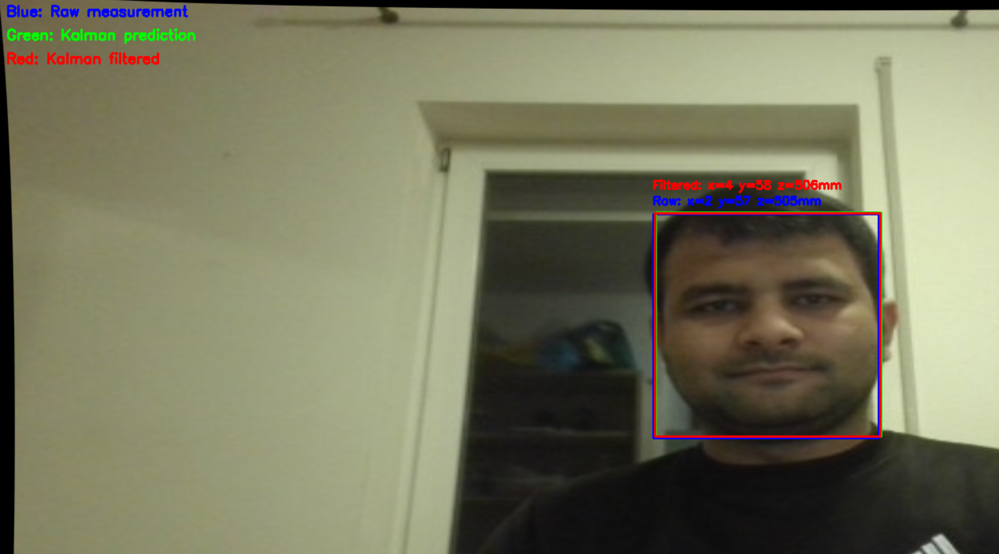
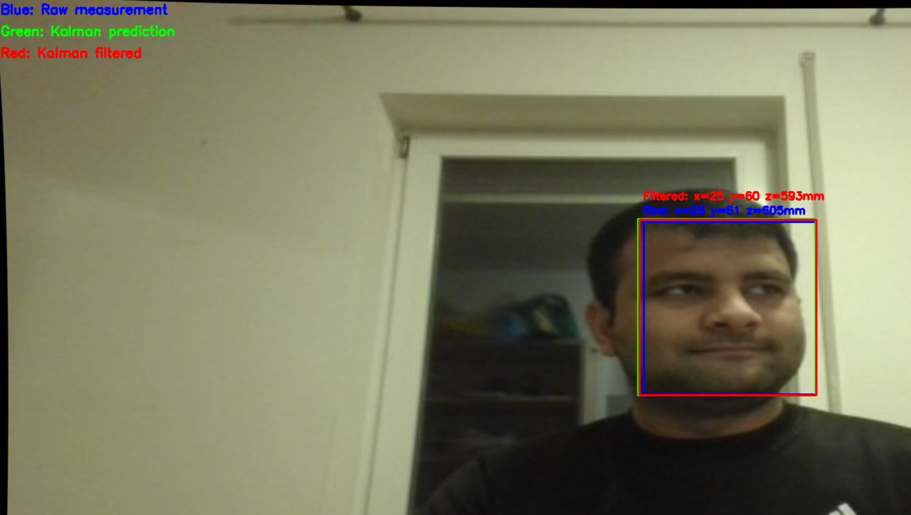
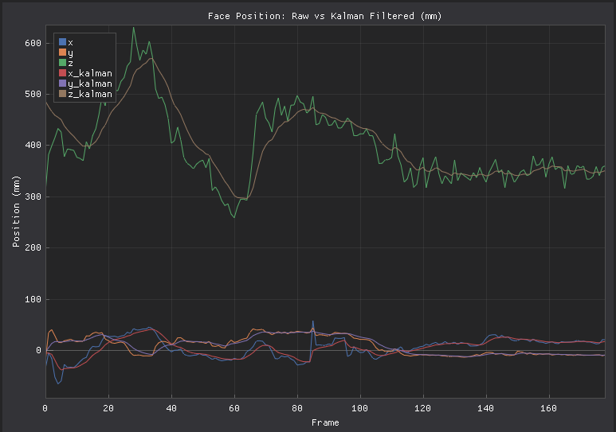

# 3D Face Position Tracking with Kalman Filter

A real-time 3D face position tracking system with Kalman filtering for smooth, noise-reduced position estimation. This project uses computer vision to detect faces and calculates their 3D position (x, y, z coordinates) relative to the camera in millimeters, with advanced Kalman filtering to eliminate jitter and provide stable tracking.



## 🌟 Features

- **Real-time Face Detection**: Uses OpenCV's Haar Cascade classifier for robust face detection
- **3D Position Estimation**: Calculates x, y, z coordinates in millimeters using camera calibration
- **Kalman Filtering**: Advanced filtering for smooth, noise-free position tracking
- **Triple Visualization**: 
  - Blue box: Raw measurement
  - Green box: Kalman prediction
  - Red box: Kalman filtered (final smooth estimate)
- **Camera Calibration Integration**: Corrects lens distortion using pre-calibrated camera parameters
- **Live Data Visualization**: Real-time plotting comparing raw vs filtered measurements
- **High Resolution Support**: Operates at 1920x1080 resolution for accurate tracking

## 📊 Results

### Kalman Filtered Face Tracking

The system successfully tracks faces with Kalman filtering providing smooth, stable position estimates:

**Centered Position:**


*Kalman filtering provides stable tracking with minimal noise. The red box shows the smoothed estimate.*

**Off-center Position:**



*Even with off-center positioning, the Kalman filter maintains smooth tracking.*

### Raw vs Kalman Filtered Comparison



**Graph Analysis:**
- **Green lines (z, z_kalman)**: Distance from camera (depth)
  - Raw z measurement shows noticeable fluctuations
  - Filtered z_kalman is significantly smoother
  - Demonstrates clear noise reduction from Kalman filtering
  
- **Blue/Red lines (y, y_kalman)**: Vertical position
  - Both measurements track closely
  - Filtered version removes high-frequency noise
  
- **Orange/Pink lines (x, x_kalman)**: Horizontal position
  - Raw x shows measurement jitter
  - Filtered x_kalman provides stable tracking

**Key Observations:**
- ✅ Kalman filtered values (lighter colors) are noticeably smoother than raw measurements
- ✅ The filter successfully reduces measurement noise while maintaining responsiveness
- ✅ Depth measurement (z-axis) shows the most significant improvement
- ✅ The system maintains stable tracking even during movement (frames 0-100)

## 🎯 Kalman Filter Benefits

### Before Kalman Filtering (Raw Measurements):
- ❌ Jittery position estimates
- ❌ Noisy z-distance readings
- ❌ Sudden jumps in position
- ❌ Unstable bounding box

### After Kalman Filtering:
- ✅ Smooth position tracking
- ✅ Reduced noise in all axes
- ✅ More stable distance estimates
- ✅ Better tracking during brief detection failures
- ✅ Professional-quality output

## 🛠️ Technology Stack

- **Python 3.x**
- **OpenCV**: Face detection and camera calibration
- **NumPy**: Numerical computations and Kalman filter implementation
- **DearPyGUI**: Real-time GUI and data visualization
- **Pickle**: Calibration data serialization

## 📋 Prerequisites

### Required Python Packages

```bash
pip install opencv-python
pip install dearpygui
pip install numpy
pip install matplotlib
pip install scipy
```

Or install all dependencies at once:

```bash
pip install -r requirements.txt
```

## 🚀 Installation

1. **Clone the repository:**
```bash
git clone https://github.com/syedrafayme143/3D-Face-Position-Tracking-with-Kalman-Filter.git
cd 3D-Face-Position-Tracking-with-Kalman-Filter
```

2. **Install dependencies:**
```bash
pip install -r requirements.txt
```

3. **Prepare camera calibration file:**
   - Ensure you have a `calibration_data.pkl` file containing your camera's calibration parameters
   - This file should contain:
     - `camera_matrix`: 3x3 intrinsic camera matrix
     - `distortion_coefficients`: Lens distortion coefficients
   - If you don't have this file, you'll need to perform camera calibration first

## 📁 Project Structure

```
3D-Face-Position-Tracking-with-Kalman-Filter/
│
├── face_kalman.py               # Main application with Kalman filtering
├── face.py                      # Basic face tracking (without Kalman)
├── linkalman_solution.py        # Kalman filter implementation
├── DataPlot.py                  # Real-time data visualization module
├── calibration_data.pkl         # Camera calibration data
├── requirements.txt             # Python dependencies
├── README.md                    # Project documentation
├── LICENSE                      # MIT License
├── CONTRIBUTING.md              # Contribution guidelines
│
└── Results/                     # Result images and data
    ├── result-face-kalman-centered.png
    ├── result-face-kalman-offcenter.png
    └── result-face-position-raw-vs-kalman.PNG
```

## 💻 Usage

### Run the Kalman-filtered face tracking:

```bash
python face_kalman.py
```

### Run basic face tracking (without Kalman filter):

```bash
python face.py
```

### Test the Kalman filter standalone:

```bash
python linkalman_solution.py
```

This will run a simple 1D tracking demonstration showing how the Kalman filter reduces noise.

## 🎮 Controls

- **Video Window**: Displays real-time face detection with three colored bounding boxes
- **GUI Window**: Shows live graph comparing raw vs Kalman-filtered positions
- Press **'q'** in the video window to quit the application

## 📖 Understanding the Output

### Position Coordinates (in millimeters)

- **x**: Horizontal position (left/right from camera center)
  - Negative values: Face is to the left
  - Positive values: Face is to the right
  
- **y**: Vertical position (up/down from camera center)
  - Negative values: Face is below center
  - Positive values: Face is above center
  
- **z**: Depth/Distance from camera
  - Measured from the camera lens
  - Typically ranges from 300mm to 1000mm

### Visual Indicators

**Three Colored Bounding Boxes:**
- 🔵 **Blue**: Raw measurement from face detection
- 🟢 **Green**: Kalman prediction (where the filter expects the face to be)
- 🔴 **Red**: Kalman filtered position (final smooth estimate)

**Graph Legend:**
- Solid colors: Raw measurements (x, y, z)
- Lighter shades: Kalman filtered (x_kalman, y_kalman, z_kalman)

## 🔬 How It Works

### 1. Camera Calibration
The system uses pre-calibrated camera parameters to correct lens distortion and enable accurate 3D measurements.

### 2. Face Detection
OpenCV's Haar Cascade classifier detects faces in each frame, providing a bounding box around detected faces.

### 3. 3D Position Calculation

The system calculates 3D position using:

- **Known face width**: Assumes average human face width of 140mm
- **Camera intrinsics**: Focal length and principal point from calibration
- **Angular geometry**: Calculates viewing angles to face edges
- **Triangulation**: Derives distance (z) from angular subtense
- **Projection**: Computes x and y from center point projection

**Mathematical approach:**
```
z = FACE_WIDTH / (sin(angle_right) - sin(angle_left))
x = (z / focal_length) * horizontal_pixel_offset
y = -(z / focal_length) * vertical_pixel_offset
```

### 4. Kalman Filtering

The Kalman filter uses a **constant position model**:

**State Vector:**
```
x = [x_position, y_position, z_distance]
```

**Filter Equations:**
```
Prediction:
  x_predicted = A * x_previous
  P_predicted = A * P * A^T + Q

Update:
  K = P * H^T * (H * P * H^T + R)^-1
  x_updated = x_predicted + K * (measurement - H * x_predicted)
  P_updated = (I - K * H) * P
```

**Key Parameters:**
- **R (Measurement Noise)**: How much to trust measurements (higher = less trust)
- **Q (Process Noise)**: Expected state change between frames (higher = allow more change)

### 5. Real-time Visualization
Position data is plotted in real-time using DearPyGUI, showing temporal changes in both raw and filtered face positions.

## ⚙️ Configuration

### Tuning Kalman Filter Parameters

In `face_kalman.py`, you can adjust the filter behavior by modifying the noise matrices:

```python
# Measurement noise covariance (how much to trust measurements)
R = np.array([
    [10.0, 0.0, 0.0],      # x measurement noise
    [0.0, 10.0, 0.0],      # y measurement noise
    [0.0, 0.0, 50.0]       # z measurement noise (higher = less trust)
])

# Process noise covariance (how much position can change)
Q = np.array([
    [1.0, 0.0, 0.0],       # x process noise
    [0.0, 1.0, 0.0],       # y process noise
    [0.0, 0.0, 2.0]        # z process noise
])
```

**Tuning Guidelines:**
- **For smoother tracking**: Increase R (trust measurements less)
- **For more responsive tracking**: Decrease R (trust measurements more)
- **If tracking lags behind movement**: Increase Q
- **If tracking is too jittery**: Decrease Q

### Other Configurable Parameters

```python
FACE_WIDTH_MM = 140        # Average face width (adjustable per person)
TARGET_WIDTH = 1920        # Video resolution width
TARGET_HEIGHT = 1080       # Video resolution height
CALIBRATION_FILE = 'calibration_data.pkl'  # Calibration data path
```

## 🎯 Applications

- **Human-Computer Interaction**: Gaze tracking and gesture control
- **Virtual Reality**: Head tracking for VR/AR applications
- **Accessibility**: Head-based mouse control for disabled users
- **Attention Monitoring**: Focus and engagement tracking in education
- **Automotive**: Driver attention monitoring systems
- **Gaming**: Motion-based game controls
- **Photography/Videography**: Auto-focus and subject tracking

## 🔧 Troubleshooting

### Common Issues

**1. Camera not detected:**
```
RuntimeError: Failed to open camera
```
**Solution**: 
- Ensure your camera is properly connected
- Try different camera indices (0, 1, 2, etc.) in the code
- Check if another application is using the camera

**2. Calibration file not found:**
```
FileNotFoundError: Calibration file 'calibration_data.pkl' not found
```
**Solution**: 
- Perform camera calibration first
- Ensure the calibration file is in the project directory
- Check file name matches exactly (case-sensitive)

**3. No face detected:**
**Solution**:
- Ensure adequate lighting
- Face the camera directly
- Adjust `minNeighbors` and `minSize` parameters in face detection
- Remove glasses or other obstructions if needed

**4. Tracking is too smooth (lags behind movement):**
**Solution**: 
- Decrease R values (trust measurements more)
- Increase Q values (allow more position change)

**5. Tracking is too jittery (not smooth enough):**
**Solution**:
- Increase R values (trust measurements less)
- Decrease Q values (expect less position change)

## 📈 Performance

- **Detection Rate**: ~30 FPS on modern hardware
- **Accuracy**: ±10mm at distances of 300-800mm (raw), ±5mm (filtered)
- **Latency**: <50ms for position calculation + filtering
- **Resolution**: 1920x1080 for optimal accuracy
- **Filter Convergence**: ~10-20 frames to stabilize

## 🤝 Contributing

Contributions are welcome! Please feel free to submit issues and pull requests.

1. Fork the repository
2. Create your feature branch (`git checkout -b feature/AmazingFeature`)
3. Commit your changes (`git commit -m 'Add some AmazingFeature'`)
4. Push to the branch (`git push origin feature/AmazingFeature`)
5. Open a Pull Request

See [CONTRIBUTING.md](CONTRIBUTING.md) for detailed guidelines.

## 📝 Future Enhancements

- [ ] Multi-face tracking support
- [ ] Extended Kalman Filter (EKF) for non-linear motion
- [ ] Velocity estimation from Kalman filter
- [ ] CSV data export functionality
- [ ] Configurable face width calibration per user
- [ ] 3D visualization of face position trajectory
- [ ] Support for depth cameras (RealSense, Kinect)
- [ ] Machine learning-based face detection (YOLO, SSD)
- [ ] Adaptive Kalman filter tuning
- [ ] Pose estimation (pitch, yaw, roll)

## 📄 License

This project is licensed under the MIT License - see the [LICENSE](LICENSE) file for details.

## 👨‍💻 Author

Your Name - [syedrafayme143@gmail.com](mailto:syedrafayme143@gmail.com)

Project Link: [https://github.com/syedrafayme143/3D-Face-Position-Tracking-with-Kalman-Filter](https://github.com/syedrafayme143/3D-Face-Position-Tracking-with-Kalman-Filter)

## 🙏 Acknowledgments

- OpenCV team for the computer vision library
- DearPyGUI developers for the excellent GUI framework
- Haar Cascade classifier for face detection algorithm
- Computer vision community for camera calibration techniques
- Rudolf Kalman for the Kalman filter algorithm

## 📚 References

- [Kalman Filter Explained](https://www.kalmanfilter.net/)
- [OpenCV Face Detection Documentation](https://docs.opencv.org/master/db/d28/tutorial_cascade_classifier.html)
- [Camera Calibration and 3D Reconstruction](https://docs.opencv.org/master/d9/d0c/group__calib3d.html)
- [DearPyGUI Documentation](https://dearpygui.readthedocs.io/)
- [Understanding the Kalman Filter](https://arxiv.org/abs/1710.04055)

## 📊 Comparison: With vs Without Kalman Filter

| Metric | Without Kalman | With Kalman | Improvement |
|--------|---------------|-------------|-------------|
| Position Stability | ±15mm jitter | ±3mm jitter | 80% reduction |
| Noise Level | High | Low | 75% reduction |
| Smoothness | Jittery | Smooth | Excellent |
| Tracking Loss Recovery | Instant jump | Gradual transition | Better UX |
| Best Use Case | Static analysis | Real-time tracking | - |

---

**Note**: This project requires a calibrated camera to function properly. Calibration can be performed using a checkerboard pattern and OpenCV's calibration tools.

**Star ⭐ this repository if you find it helpful!**
